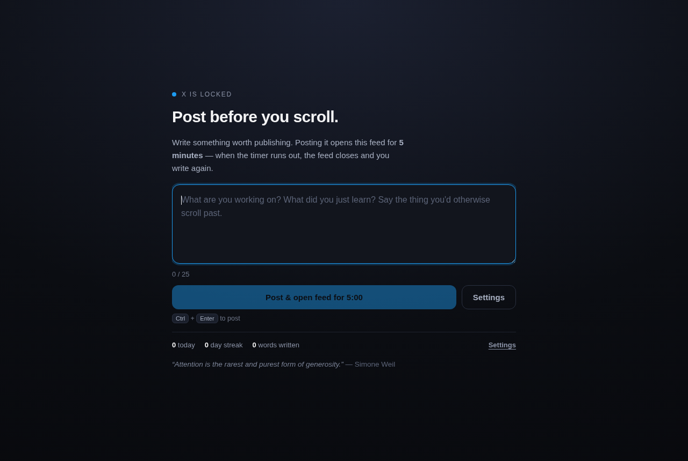

# Free Radicals

**Social feeds stay closed until you publish something.** Writing a post buys
you one five-minute window. When the timer hits zero the feed closes, and the
next window costs another post.

Produce before you consume.



A Chrome extension, plus a shared core designed so the same gate can run as a
mobile overlay — see [the port guide](mobile/README.md).

## The rule

```
locked ──► write something real ──► post ──► 5:00 of feed ──► locked
   ▲                                                             │
   └─────────────────── and the next window costs another post ──┘
```

## Install

Nothing to build — the repository *is* the unpacked extension.

1. `chrome://extensions` → turn on **Developer mode**
2. **Load unpacked** → select this folder
3. Open `x.com/home`

Chrome 111+.

## What it gates

X, Facebook, Instagram, LinkedIn, Reddit, YouTube, TikTok, Threads, Bluesky and
Mastodon — each one toggleable in settings.

It is deliberately not a blanket ban on the site. `reddit.com/` is blocked;
a thread you chose to open is not. YouTube's home page is blocked; a video you
searched for plays, minus the recommendation rail. Your DMs and your own profile
stay reachable. The target is the infinite feed, not the network.

## What counts as a post

By default: 25 characters that are not filler, and not something you have posted
in the last 25 entries. Casing and spacing changes do not make a repeat new.

That is the honest default — the extension takes your word that you published
it, and puts the text on your clipboard and the site's composer one click away.

If you want the stricter version, turn on **require proof of publishing**: the
timer then starts when your post is actually seen going out to the network, not
when you press the button. It works by watching for the request a successful
post makes, so it is only as durable as those private endpoints — there is a
90-second escape hatch for when a network changes one, and it is off by default.
Details in [docs/PRIVACY.md](docs/PRIVACY.md).

## Settings

| | Default |
| --- | --- |
| Window length | 5 minutes |
| Minimum post | 25 characters |
| Warn near the end | last 60 seconds |
| Require proof of publishing | off |
| Help me publish it | on |
| Refuse repeats | on, last 25 posts |

## Privacy

No server, no account, no analytics, no network requests of its own. Everything
lives in your browser profile, and the options page will export or delete it.
Full detail: [docs/PRIVACY.md](docs/PRIVACY.md).

## Mobile

The gate logic lives in `core/`, which imports nothing — no DOM, no `chrome.*`,
no React Native. A test fails the build if that ever changes. The Chrome
extension is one shell over it; a mobile app is another.

`mobile/bridge/` is real, runnable JavaScript: an AsyncStorage adapter, the gate
controller, a React hook, and the block screen translated to React Native
primitives. `mobile/android/` and `mobile/ios/` are reference implementations of
the parts that must be native.

The short version of what ports and what does not:

- **Android** does what the extension does — `UsageStatsManager` to see the
  foreground app, `SYSTEM_ALERT_WINDOW` to draw the block screen over it.
- **iOS cannot overlay another app, ever.** The supported route is Screen Time
  (FamilyControls + ManagedSettings + DeviceActivity), which shields the app and
  routes its unlock button into yours. It needs an entitlement from Apple.

Both work because a window is stored as an absolute timestamp, so native code
gets one number and needs no running JavaScript. Full guide:
[mobile/README.md](mobile/README.md).

## Development

```bash
npm test              # 27 unit tests: the state machine, anti-cheat, portability
npm run test:e2e      # loads the extension into real Chromium and drives it
npm run build         # regenerate manifest.json, route/signal tables, icons
```

The e2e test is the one that matters: it stubs `x.com`, confirms the feed is
blocked on arrival, posts through the popup, watches the feed open, expires the
window, and confirms it slams shut and refuses the same text again.

Adding a network is one record in `core/platforms.js` and a rebuild —
see [docs/ARCHITECTURE.md](docs/ARCHITECTURE.md).

## Limits, stated plainly

You can disable this extension in about three clicks, and that is on purpose.
It is a speed bump between the reflex and the feed, not a lock. A tool that
fights its owner gets uninstalled by the end of the week.
